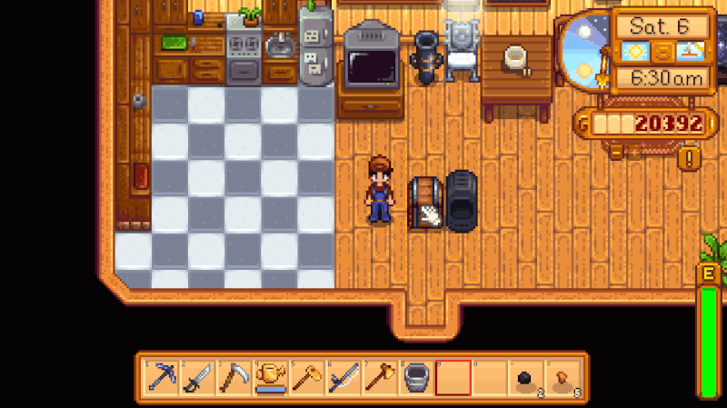

**CJB Automation** is a [Stardew Valley](http://stardewvalley.net/) mod that lets you place a chest
next to a machine (like a furnace, cheese press, bee house, etc), and the machine will
automatically pull raw items from the chest and push processed items into it:

Compatible with Stardew Valley 1.1+ on Linux, Mac, and Windows.

## Installation
1. [Install the latest version of SMAPI](https://github.com/Pathoschild/SMAPI/releases).
2. [Install this mod from Nexus mods](http://www.nexusmods.com/stardewvalley/mods/211).
3. Run the game using SMAPI.

## Configuration
The mod will work fine out of the box, but you can tweak its settings by editing the `config.json`
file. These are the available settings.

setting | default | what it affects
------- | ------- | ---------------
`diagonal` | `false` | Whether to link with chests which are diagonally adjacent to the machine.

## Versions
1.5 (2017-04-01):
* Updated to SMAPI 1.9.
* Fixed refined quartz recipe not using coal.
* Internal refactoring.

1.4 (2017-01-04):
* Updated to Stardew Valley 1.1+ and SMAPI 1.5.
* Added compatibility with Linux and Mac.
* Added support for casks, mushroom cave boxes, and slime egg-presses.
* Added support for coffee, mead, and void mayonnaise.
* Fixed error when automating seed maker.
* Fixed juices and wines not correctly named.

1.3 (2016-04-02):
* Added tapper.
* Added lightning rod.
* Fixed wrong beehouse output.

1.2 (2016-03-30):
* Fixed automation in barns and coops.
* Added config file to toggle diagonal chests support (default `false`).

1.1 (2016-03-30):
* Added support for recycling machines, seed makers, and oil makers.

1.0 (2016-03-29):
* First release.
