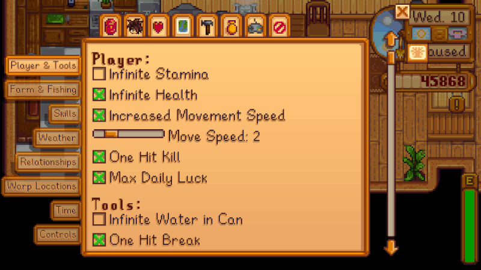

**CJB Cheats Menu** is a [Stardew Valley](http://stardewvalley.net/) mod that adds an in-game menu
with many different cheat features:

Compatible with Stardew Valley 1.3+ on Linux, Mac, and Windows. Translated into Chinese, English,
Japanese, Portuguese, and Russian.

## Install
1. [Install the latest version of SMAPI](https://smapi.io/).
2. [Install this mod from Nexus mods](http://www.nexusmods.com/stardewvalley/mods/4).
3. Run the game using SMAPI.

## Use
* Press `P` (configurable) to show the cheats menu.
* You can also enable active cheats by editing the `config.json` file.

## Configure
The mod will work fine out of the box, but you can tweak its settings by editing the `config.json`
file. You can also edit these values through the in-game settings menu. These are the available
settings.

### Key bindings
(See [valid key bindings](https://stardewvalleywiki.com/Modding:Player_Guide/Key_Bindings).)

setting | default | what it affects
------- | ------- | ---------------
`OpenMenuKey` | `P` | The button which opens the menu.
`FreezeTimeKey` | `T` | The button which freezes the game clock.
`GrowTreeKey` | `NumPad1` | The button which instantly grows the tree under the tool cursor.
`GrowCropsKey` | `NumPad2` | The button which instantly grows crops adjacent to your character.

### Menu settings

setting | default | what it affects
------- | ------- | ---------------
`DefaultTab` | `PlayerAndTools` | The tab shown by default when you open the menu. Possible values: `PlayerAndTools`, `FarmAndFishing`, `Skills`, `Weather`, `Relationships`, `WarpLocations`, `Time`, `Controls`.

### Player cheats
setting | default | what it affects
------- | ------- | ---------------
`IncreasedMovement` | `false` | Whether your character moves faster. The added speed is set by the `MoveSpeed` field.
`MoveSpeed` | `1` | The player speed to add if `IncreasedMovement` is `true`. This is an added multiplier (e.g. `1` doubles the default speed).
`InfiniteHealth` | `false` | Your health never decreases.
`InfiniteStamina` | `false` | Your stamina never decreases.
`MaxDailyLuck` | `false` | Your daily luck is always at the maximum value.
`OneHitKill` | `false` | Your attacks kill any monster in one hit.
`OneHitBreak` | `false` | Your tools break things instantly.
`InfiniteWateringCan` | `false` | Your watering can never runs dry.
`HarvestSickle` | `false` | You can harvest any crop with the sickle.

### Fishing cheats
setting | default | what it affects
------- | ------- | ---------------
`InstantBite` | `false` | After casting the fishing line, the fishing minigame appears immediately.
`InstantCatch` | `false` | When the fishing minigame appears, the fish is caught immediately.
`ThrowBobberMax` | `false` | When casting the fishing line, it always reaches the maximum distance.
`DurableTackles` | `false` | Fishing tackles never break.
`AlwaysTreasure` | `false` | Every fishing minigame has a treasure.

### Time cheats
setting | default | what it affects
------- | ------- | ---------------
`FreezeTime` | `false` | The game clock never changes.
`FreezeTimeInside` | `false` | The game clock doesn't change when you're inside a building.
`FreezeTimeCaves` | `false` | The game clock doesn't change when you're inside the mines, Skull Cavern, or farm cave.
`FastCask` | `false` | Casks finish instantly.
`FastFruitTrees` | `false` | Fruit trees produce fruit instantly.
`FastFurnace` | `false` | Furnaces finish instantly.
`FastRecyclingMachine` | `false` | Recycling machines finish instantly.
`FastCrystalarium` | `false` | Crystalariums finish instantly.
`FastIncubator` | `false` | Incubators finish instantly.
`FastSlimeIncubator ` | `false` | Slime incubators finish instantly.
`FastKeg` | `false` | Kegs finish instantly.
`FastPreservesJar` | `false` | Preserves jars finish instantly.
`FastCheesePress` | `false` | Cheese presses finish instantly.
`FastMayonnaiseMachine ` | `false` | Mayonnaise machines finish instantly.
`FastLoom` | `false` | Looms finish instantly.
`FastOilMaker` | `false` | Oil makers finish instantly.
`FastSeedMaker` | `false` | Seed makers finish instantly.
`FastCharcoalKiln` | `false` | Charcoal kilns finish instantly.
`FastSlimeEggPress` | `false` | Slime egg presss finish instantly.
`FastBeeHouse` | `false` | Beehouses finish instantly.
`FastMushroomBox` | `false` | Mushroom boxs finish instantly.
`FastTapper` | `false` | Tappers finish instantly.
`FastLightningRod` | `false` | Lightning rods finish instantly.
`FastWormBin` | `false` | Worm bins finish instantly.

### Other cheats
setting | default | what it affects
------- | ------- | ---------------
`AlwaysGiveGift` | `false` | You can always give gifts to villagers, regardless of the daily and weekly limits.
`NoFriendshipDecay` | `false` | A villager's friendship value no longer slowly decays if it isn't maxed out.
`DurableFences` | `false` | Fences never break.
`InstantBuild` | `false` | Building new structures on the farm completes instantly.
`AutoFeed` | `false` | Feed troughs in barns and coops are refilled automatically.
`InfiniteHay` | `false` | Hay silos are always full.

## See also
* [Release notes](release-notes.md)
