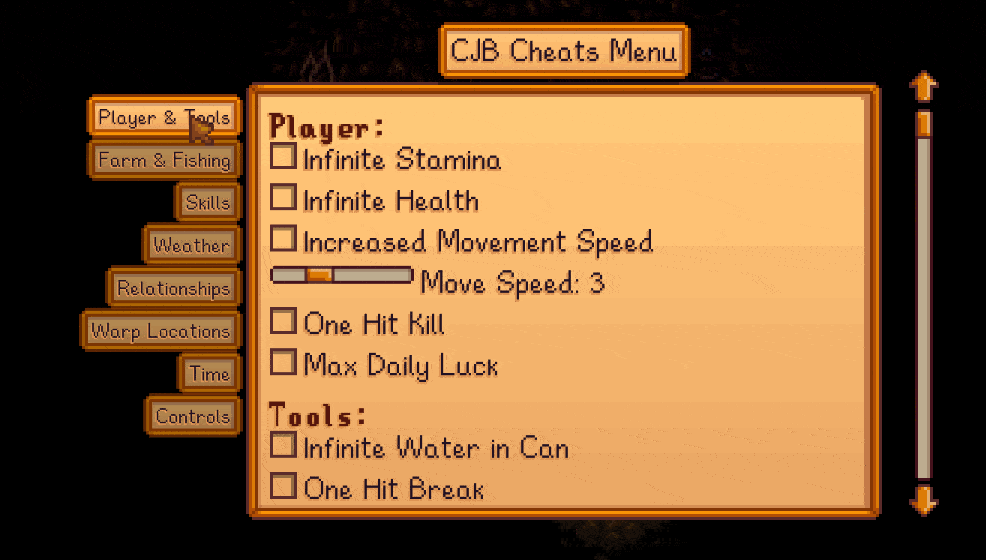

**CJB Cheats Menu** is a [Stardew Valley](http://stardewvalley.net/) mod that adds an in-game menu
with many different cheat features:

Compatible with Stardew Valley 1.5.5+ on Linux, macOS, and Windows.

## Install
1. [Install the latest version of SMAPI](https://smapi.io/).
2. [Install this mod from Nexus mods](http://www.nexusmods.com/stardewvalley/mods/4).
3. Run the game using SMAPI.

## Use
* Press `P` (configurable) to show the cheats menu.
* You can also enable active cheats by editing the `config.json` file.

## Configure
The mod will work fine out of the box, but you can tweak its settings by editing the `config.json`
file. Most of the settings should be edited in-game through the cheats menu instead, so only those
you may need to edit directly are listed here.

### Key bindings
See [valid key bindings](https://stardewvalleywiki.com/Modding:Player_Guide/Key_Bindings). Simple
key bindings can be configured through the in-game UI, but multi-key bindings can only be set in the
`config.json` file.

setting | default | what it affects
------- | ------- | ---------------
`OpenMenuKey` | `P` | The keybind which opens the menu.
`FreezeTimeKey` | `T` | The keybind which freezes the game clock.
`GrowTreeKey` | `NumPad1` | The keybind held to grow trees around the player.
`GrowCropsKey` | `NumPad2` | The keybind held to grow crops around the player.
`GrowRadius` | `1` | The number of tiles in each direction around the player to cover when pressing the `GrowCropsKey` or `GrowTreeKey`.

### Menu settings
setting | default | what it affects
------- | ------- | ---------------
`DefaultTab` | `PlayerAndTools` | The tab shown by default when you open the menu. Possible values: `PlayerAndTools`, `FarmAndFishing`, `Skills`, `Weather`, `Relationships`, `WarpLocations`, `Time`, `Advanced`, `Controls`.

## Editing warps
For mod authors, see the [author guide](author-guide.md) to add/edit/remove warps in the menu to
match your map edits and custom locations.

## See also
* [Release notes](release-notes.md)
