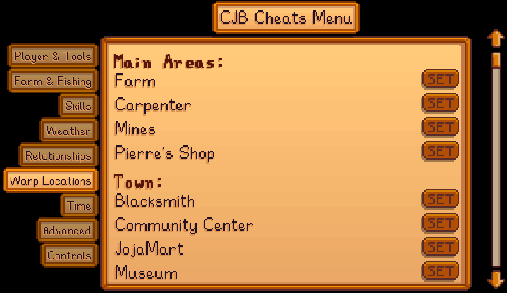

← [README](README.md)

This page helps mod authors make changes to CJB Cheats Menu.

**See the [main README](README.md) for other info.**

# Edit warps
## Overview
You can edit the sections and warps shown in the CJB Cheats Menu UI. This is typically used to
adjust default warps for your map changes, or to add new warps for your custom locations.

For example, in this image "Main Areas" is a warp section and "Farm" is a warp within it:


## Warp sections
You can edit the `Mods/CJBok.CheatsMenu/WarpSections` asset to add/remove/edit/reorder warp
sections.

The available fields are:

field         | effect
------------- | ------
`Id`          | The [unique string ID](https://stardewvalleywiki.com/Modding:Common_data_field_types#Unique_string_ID) for this warp section. Sections which don't apply the unique ID pattern will be rejected.
`DisplayName` | The translated display name to show in the UI for this section.
`Order`       | The relative order in which to list this section in the warp menu (default 0). Lower values are listed first. Sections with the same order are sorted alphabetically.

For example, this [Content Patcher](https://stardewvalleywiki.com/Modding:Content_Patcher) patch
adds a new section:

```json
{
    "Action": "EditData",
    "Target": "Mods/CJBok.CheatsMenu/WarpSections",
    "Entries": {
        "{{ModId}}_PufferVillage": {
            "Id": "{{ModId}}_PufferVillage",
            "DisplayName": "{{i18n: warp-sections.puffer-village}}"
        }
    }
}
```

Note that:
* This assumes you added a `warp-sections.puffer-village` key in your content pack's [translation
  files](https://github.com/Pathoschild/StardewMods/blob/develop/ContentPatcher/docs/author-guide/translations.md).
* You should use the actual text `{{ModId}}` in your patch as shown. Content Patcher will replace
  it with your mod ID automatically.

## Warps
You can edit the `Mods/CJBok.CheatsMenu/Warps` asset to add/remove/edit/reorder warps within each
section.

The available fields are:

field         | effect
------------- | ------
`Id`          | The [unique string ID](https://stardewvalleywiki.com/Modding:Common_data_field_types#Unique_string_ID) for this warp. Warps which don't apply the unique ID pattern will be rejected.
`SectionId`   | The unique ID for the [warp section](#warp-sections). If the warp section doesn't exist, one will be created with this ID as its display name.
`DisplayName` | The translated display name to show in the UI for this section.
`Location`    | The internal name of the target location (not the translated name). You can use the [Debug Mode](https://www.nexusmods.com/stardewvalley/mods/679) mod to see location names in-game.
`Tile`        | The target [tile coordinate](https://stardewvalleywiki.com/Modding:Modder_Guide/Game_Fundamentals#Tiles), in the form `x, y`. You can use the [Debug Mode](https://www.nexusmods.com/stardewvalley/mods/679) mod to see tile coordinates in-game.
`Order`       | The relative order in which to list it in the warp menu (default 0). Lower values are listed first. Warps with the same order are sorted alphabetically.
`SpecialBehavior` | _Deprecated_. The [special warp behavior](#special-warp-behavior) to apply.

For example, this [Content Patcher](https://stardewvalleywiki.com/Modding:Content_Patcher) patch
adds a new warp to the section we defined above:

```json
{
    "Action": "EditData",
    "Target": "Mods/CJBok.CheatsMenu/Warps",
    "Entries": {
        "{{ModId}}_PufferVillage_MayorHouse": {
            "Id": "{{ModId}}_PufferVillage_MayorHouse",
            "SectionId": "{{ModId}}_PufferVillage",
            "DisplayName": "{{i18n: warps.mayor-house}}",
            "Location": "{{ModId}}_PufferVillage",
            "Tile": "16, 32"
        }
    }
}
```

Note that:
* This assumes you added a `warps.mayor-house` key in your content pack's [translation
  files](https://github.com/Pathoschild/StardewMods/blob/develop/ContentPatcher/docs/author-guide/translations.md).
* You should use the actual text `{{ModId}}` in your patch as shown. Content Patcher will replace
  it with your mod ID automatically.
* In this example, `{{ModId}}_PufferVillage` is the internal name of the hypothetical location we
  added; matching the section ID is coincidental.

## Special warp behavior
Warps can set the `SpecialBehavior` field to enable special warp logic. The valid values are:

value             | effect
----------------- | ------
`Casino`          | Hide warp if the player doesn't have the club card.
`CommunityCenter` | Hide warp if the community center is demolished.
`Farm`            | Warp to the current player's cabin or farmhouse. The `Location` and `Tile` fields are ignored.
`JojaMart`        | Hide warp if the JojaMart is demolished.
`MovieTheaterCommunity` | Hide warp if the movie theater isn't built, or was built through the Joja route.
`MovieTheaterJoja`      | Hide warp if the movie theater isn't built, or was built through the community route.

## See also
* [README](README.md) for other info
* [Ask for help](https://stardewvalleywiki.com/Modding:Help)
