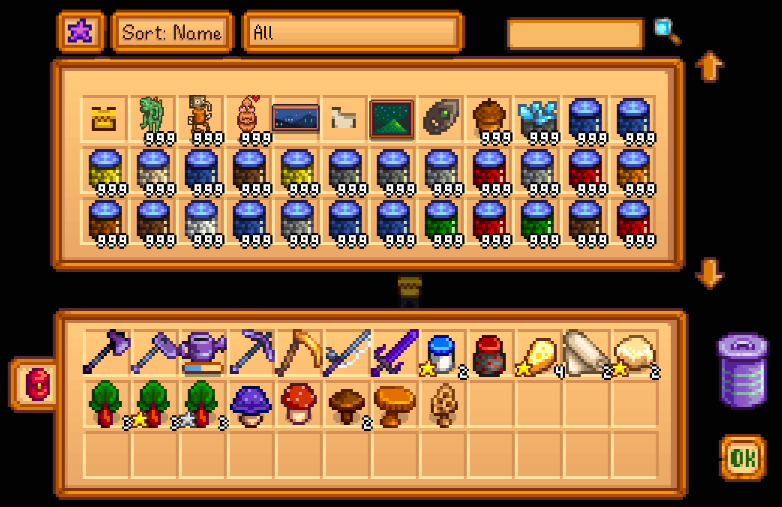

**CJB Item Spawner** is a [Stardew Valley](http://stardewvalley.net/) mod that lets you spawn items
with just a few clicks:

Compatible with Stardew Valley 1.3+ on Linux, Mac, and Windows. Translated into English, Portuguese,
and Russian.

## Install
1. [Install the latest version of SMAPI](https://smapi.io/).
2. [Install this mod from Nexus mods](http://www.nexusmods.com/stardewvalley/mods/93).
3. Run the game using SMAPI.

## Use
* Press `i` on your keyboard (configurable) to open up the menu.
* Change item quality by hovering over the item, holding left-shift, then using the mouse wheel to
  increase or decrease the quality level.

## Configure
The mod will work fine out of the box, but you can tweak its settings by editing the `config.json`
file. These are the available settings.

setting | default | what it affects
------- | ------- | ---------------
`ShowMenuKey` | `P` | The button which opens the menu (see [valid key bindings](https://stardewvalleywiki.com/Modding:Player_Guide/Key_Bindings)).
`AllowProblematicItems` | `false` | Whether to show items which may cause bugs or crashes when spawned.

## FAQs
### What are 'problematic items'?
You can [edit `config.json`](#configure) to enable problematic items, which are normally hidden
because they cause in-game issues, glitches, or crashes. These are the items considered problematic:

item | issue
---- | -----
Crystal Chair | (Unreleased version.) Glitches and causes crashes once rotated / picked up.
Incubator | Can't be removed once placed.
Locked Door | Can't be removed once placed.
Mushroom Box | Can't be removed once placed (unless you install the [Moveable Mushroom Boxes](https://www.nexusmods.com/stardewvalley/mods/2852) mod _before_ spawning them).
Obelisk | Once placed, it runs a glitched animation when the player is near that eventually starts switching between the Obelisk and a chicken statue sprite. Picking it up after that point can cause an immediate game crash or result in an unremovable inventory item.
Wicked Statue | (Lit eyes version.) Can't be removed once placed.
Jukebox Ring | Crashes the game when you enter the mines.

## See also
* [Release notes](release-notes.md)