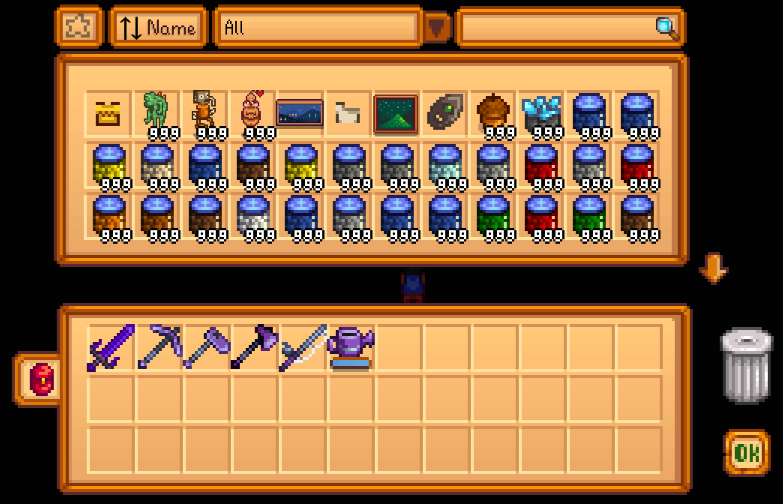

**CJB Item Spawner** is a [Stardew Valley](http://stardewvalley.net/) mod that lets you spawn items
with just a few clicks:

Compatible with Stardew Valley 1.1+ on Linux, Mac, and Windows.

## Usage
* Press the `i` button on your keyboard to open up the menu.
* Change item quality by hovering over the item, holding left-shift, then using the mouse wheel to
  increase or decrease the quality level.

## Installation
1. [Install the latest version of SMAPI](https://github.com/Pathoschild/SMAPI/releases).
2. [Install this mod from Nexus mods](http://www.nexusmods.com/stardewvalley/mods/93).
3. Run the game using SMAPI.

## Versions
1.0–1.5:
* Initial versions.

1.6:
* Updated to Stardew Valley 1.1+ and SMAPI 1.5.
* Added support for new iridium quality.
