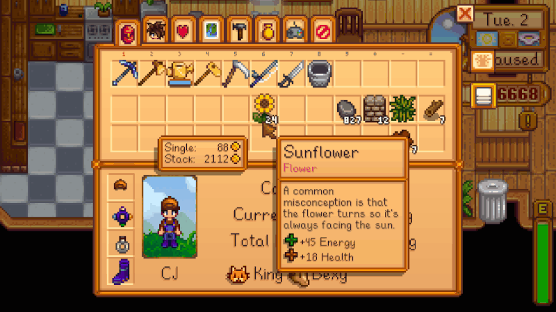

**CJB Show Item Sell Price** is a [Stardew Valley](http://stardewvalley.net/) mod shows the sell
price of items in your inventory:

Compatible with Stardew Valley 1.1+ on Linux, Mac, and Windows.

## Installation
1. [Install the latest version of SMAPI](https://github.com/Pathoschild/SMAPI/releases).
2. [Install this mod from Nexus mods](http://www.nexusmods.com/stardewvalley/mods/5).
3. Run the game using SMAPI.

## Versions
1.7 (2017-04-01):
* Updated to SMAPI 1.9.

1.6 (2017-01-04):
* Updated to Stardew Valley 1.1+ and SMAPI 1.5.
* Added compatibility with Linux and Mac.

1.0–1.5:
* Initial versions.

1.6:
* Updated to Stardew Valley 1.1+ and SMAPI 1.5.
